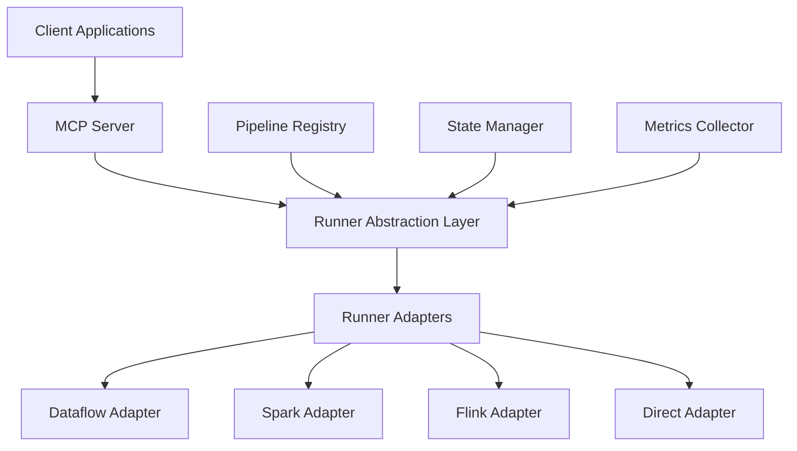
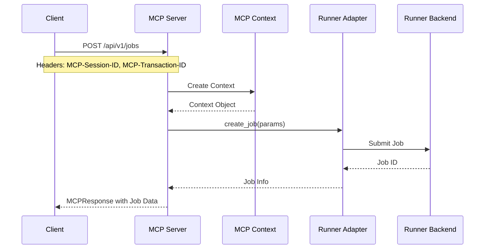
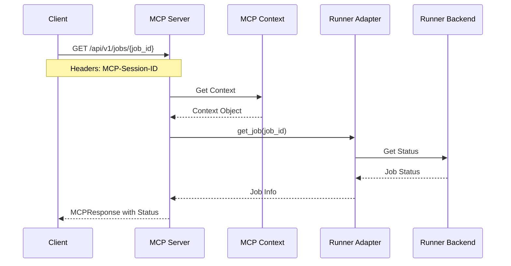
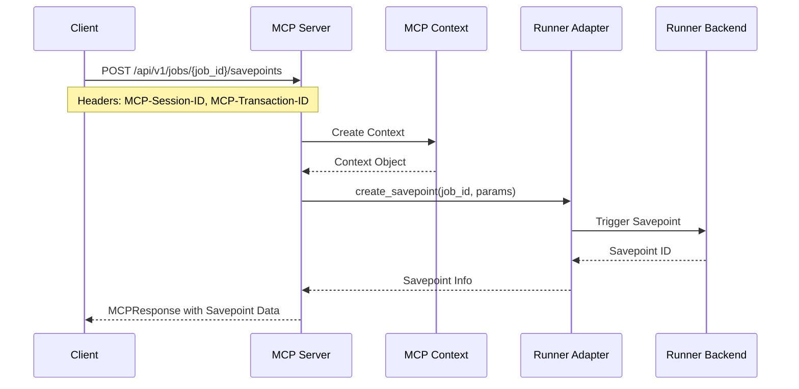

# Apache Beam MCP Server Design Document

## Table of Contents

- [Overview](#overview)
- [Architecture](#architecture)
- [Runner Interoperability](#runner-interoperability)
- [Implementation Details](#implementation-details)
- [Integration Guide](#integration-guide)
- [Development Roadmap](#development-roadmap)
- [Best Practices](#best-practices)
- [Examples and Demonstrations](#examples-and-demonstrations)
  - [WordCount Multi-Runner Implementation](#wordcount-multi-runner-implementation)

## Overview

The Apache Beam MCP Server provides a standardized interface for managing Apache Beam pipelines across different production runners (Dataflow, Spark, Flink) through the Model Context Protocol (MCP). While the Direct runner is supported for local development and testing, the primary focus is on production runners.

### Key Features

- **Production Runner Support**
  - Google Cloud Dataflow
  - Apache Spark
  - Apache Flink
- **Seamless Pipeline Portability**
  - Runner-agnostic pipeline definitions
  - Automatic optimization hints
  - State management compatibility
- **Unified Management Interface**
  - Consistent job lifecycle management
  - Standardized metrics collection
  - Cross-runner monitoring capabilities
- **Advanced State Management**
  - Checkpoint coordination
  - Savepoint management
  - State backend flexibility

## Architecture

### Core Components



### Component Details

#### Runner Abstraction Layer

- Common interface for all runners
- Pipeline portability handling
- Runner-specific optimization hints
- Resource management

#### Runner Adapters

- Runner-specific implementations
- Native API integration
- Performance optimizations
- State management

#### Pipeline Registry

- Pipeline versioning
- Template management
- Code/JAR management
- Dependency tracking

#### State Manager

- Checkpoint coordination
- Savepoint management
- State backend integration
- Recovery handling

#### Metrics Collector

- Unified metrics interface
- Runner-specific metrics
- Custom metrics support
- Aggregation and storage

## Runner Interoperability

The MCP Server provides cross-runner compatibility through standardized abstractions. This allows pipelines to be developed once and deployed across multiple execution engines. For a practical demonstration of this interoperability, see the [WordCount Multi-Runner Implementation](#wordcount-multi-runner-implementation) example.

### Sequence Diagrams

#### Job Creation Flow



#### Job Monitoring Flow



#### Savepoint Creation Flow



### MCP Protocol Integration

#### 1. Context Management

```python
class MCPContext:
    """Context information for MCP operations."""
    
    def __init__(
        self,
        session_id: Optional[str] = None,
        trace_id: Optional[str] = None,
        transaction_id: Optional[str] = None,
        user_id: Optional[str] = None,
        parameters: Optional[Dict[str, Any]] = None
    ):
        self.session_id = session_id or str(uuid.uuid4())
        self.trace_id = trace_id
        self.transaction_id = transaction_id
        self.user_id = user_id
        self.parameters = parameters or {}
```

#### 2. Request/Response Models

```python
class MCPRequestParams:
    """Parameters for an MCP request."""
    parameters: Dict[str, Any]

class MCPRequest:
    """Request model for MCP operations."""
    method: str
    params: MCPRequestParams

class MCPResponse:
    """Response model for MCP operations."""
    data: Optional[Any]
    error: Optional[str]
    context: Optional[Dict[str, Any]]
    metadata: Dict[str, Any]
```

#### 3. Resource Models

```python
class Runner:
    """Runner resource model."""
    mcp_resource_id: str
    name: str
    runner_type: RunnerType
    status: RunnerStatus
    description: str
    capabilities: List[str]
    config: Dict[str, Any]
    version: str
    mcp_provider: str
```

#### 4. Server Implementation

```python
class DataflowMCPServer(FastMCP):
    """MCP Server implementation."""
    
    def __init__(self, settings: Settings):
        self.settings = settings
        self.dataflow_client = DataflowClient(settings)
        self.app = FastAPI()
        self._setup_resources()
        self._setup_tools()
        self._setup_routes()

    async def get_manifest(self, request: MCPRequest, context: MCPContext) -> MCPResponse:
        """Get server manifest."""
        manifest = {
            "name": "beam-mcp",
            "version": "1.0.0",
            "description": "Apache Beam MCP Server",
            "capabilities": {
                "resources": ResourcesCapability(subscribe=True, listChanged=True),
                "tools": ToolsCapability(listChanged=True)
            }
        }
        return MCPResponse(data=manifest)
```

#### 5. Error Handling

```python
async def handle_error(self, error: Exception, context: MCPContext) -> MCPResponse:
    """Handle errors and return appropriate response."""
    if isinstance(error, HTTPException):
        return MCPResponse(error=str(error.detail))
    return MCPResponse(error=str(error))
```

#### 6. Tool Discovery

The server provides a manifest endpoint that describes available tools:

```json
{
    "tools": [
        {
            "name": "create_job",
            "description": "Create a new Dataflow job",
            "parameters": {
                "job_name": "string",
                "runner_type": "string",
                "job_type": "string",
                "code_path": "string",
                "pipeline_options": "object"
            }
        },
        {
            "name": "cancel_job",
            "description": "Cancel a running Dataflow job",
            "parameters": {
                "job_id": "string"
            }
        }
    ]
}
```

## Implementation Details

### Job Management

#### 1. Client Manager Architecture

```python
class BeamClientManager:
    """Manager for Apache Beam runner clients."""
    
    def __init__(self, config: Dict[str, Any]):
        self.config = config
        self.clients = {}
        self.init_clients()
    
    def init_clients(self):
        """Initialize runner clients based on configuration."""
        for runner_name, runner_config in self.config['runners'].items():
            if runner_config.get('enabled', False):
                runner_type = RunnerType(runner_name)
                client = ClientFactory.create_client(runner_type, runner_config)
                self.clients[runner_name] = client
```

- **Dynamic Client Loading**: Runners are loaded based on configuration
- **Factory Pattern**: Uses `ClientFactory` for client instantiation
- **Runner Isolation**: Each runner has its own client implementation
- **Configuration Management**: Runner-specific settings handled per client

#### 2. Job Lifecycle Management

```python
async def create_job(self, params: JobParameters) -> JobInfo:
    """Create a new job."""
    client = self.get_client(params.runner_type)
    job = await client.create_job(params)
    return job

async def get_job(self, job_id: str) -> JobInfo:
    """Get job information."""
    if job_id not in self.jobs:
        raise ValueError(f"Job not found: {job_id}")
    return self.jobs[job_id]

async def update_job(self, job_id: str, params: JobUpdateParameters) -> JobInfo:
    """Update job configuration."""
    job = self.jobs[job_id]
    if params.scaling:
        for key, value in params.scaling.items():
            job.pipeline_options[key] = value
    return job
```

- **Unified Interface**: Common API across all runners
- **State Management**: Consistent job state tracking
- **Resource Updates**: Dynamic resource scaling support
- **Error Handling**: Standardized error propagation

### Runner Interoperability

#### 1. Runner Abstraction

```python
class BaseRunnerClient:
    """Base class for runner clients."""
    
    async def create_job(self, params: JobParameters) -> JobInfo:
        raise NotImplementedError()
    
    async def get_job(self, job_id: str) -> Optional[JobInfo]:
        raise NotImplementedError()
    
    async def list_jobs(self) -> List[JobInfo]:
        raise NotImplementedError()
    
    async def cancel_job(self, job_id: str) -> bool:
        raise NotImplementedError()
```

- **Common Interface**: Standard methods for all runners
- **Type Safety**: Strong typing for parameters and returns
- **Optional Operations**: Runners can implement subset of features
- **Error Consistency**: Standardized error handling

#### 2. Runner-Specific Implementations

##### Dataflow Runner

```python
class DataflowClient(BaseRunnerClient):
    async def create_job(self, params: JobParameters) -> JobInfo:
        job = DataflowJob()
        job.name = params.job_name
        job.project_id = project
        job.location = region
        job.type_ = self._get_job_type(params.job_type)
        
        pipeline_options = params.pipeline_options.copy()
        if params.template_parameters:
            pipeline_options.update(params.template_parameters)
        
        response = await self.client.create_job(
            project_id=project,
            location=region,
            job=job
        )
        return self._convert_response(response)
```

- **Native Integration**: Direct use of Google Cloud APIs
- **Template Support**: Both classic and flex templates
- **Resource Management**: GCP-specific resource handling
- **Monitoring Integration**: Built-in metrics collection

##### Direct Runner

```python
class DirectClient(BaseRunnerClient):
    async def create_job(self, params: JobParameters) -> JobInfo:
        options = {
            'runner': 'DirectRunner',
            'direct_num_workers': self.config.get('direct_num_workers', 1),
            'direct_running_mode': self.config.get('direct_running_mode', 'in_memory'),
            **params.pipeline_options
        }
        
        pipeline_options = PipelineOptions.from_dictionary(options)
        if params.job_type == JobType.STREAMING:
            pipeline_options.view_as(StandardOptions).streaming = True
        
        pipeline = self._load_pipeline_from_code(
            params.code_path,
            pipeline_options
        )
        
        result = pipeline.run()
        return self._create_job_info(result)
```

- **Local Execution**: In-memory pipeline execution
- **Development Focus**: Optimized for testing and debugging
- **Resource Efficiency**: Minimal resource requirements
- **Fast Iteration**: Quick feedback for development

### State Management

#### 1. Savepoint Handling

```python
async def create_savepoint(self, job_id: str, params: SavepointParameters) -> SavepointInfo:
    """Create a savepoint for a job."""
    if job_id not in self.jobs:
        raise ValueError(f"Job not found: {job_id}")
    
    job = self.jobs[job_id]
    if job.job_type != JobType.STREAMING:
        raise ValueError("Savepoints are only supported for streaming jobs")
    
    savepoint = SavepointInfo(
        savepoint_id=f"sp-{datetime.now().strftime('%Y-%m-%d-%H%M%S')}",
        job_id=job_id,
        create_time=datetime.now().isoformat() + "Z",
        state="COMPLETED",
        location=params.savepoint_dir
    )
    
    return savepoint
```

- **Runner-Specific Storage**: Each runner manages its savepoints
- **State Verification**: Validation of savepoint compatibility
- **Async Operations**: Non-blocking savepoint creation
- **Location Management**: Flexible storage location support

#### 2. Checkpoint Coordination

```python
class SavepointRequest(BaseMCPModel):
    """Request to create a savepoint."""
    mcp_resource_type: Literal["savepoint_request"]
    job_id: str
    savepoint_path: str
    drain: bool = False
    async_: bool = True
    mcp_timeout_seconds: Optional[int] = 3600
    mcp_retry_strategy: Dict = Field(
        default_factory=lambda: {
            "max_retries": 3,
            "initial_delay_seconds": 5,
            "max_delay_seconds": 60
        }
    )
```

- **Retry Handling**: Built-in retry mechanisms
- **Timeout Management**: Configurable operation timeouts
- **Drain Support**: Graceful pipeline draining
- **Async Operations**: Background savepoint creation

### Metrics Collection

#### 1. Job Metrics

```python
async def get_job_metrics(self, job_id: str) -> JobMetrics:
    """Get metrics for a job."""
    job = self.jobs[job_id]
    
    metrics = {
        "cpu_utilization": 65.2,
        "memory_usage_gb": 12.8,
        "elements_processed": 15000000,
        "processing_rate": 3500,
        "worker_count": 10,
        "elapsed_time_ms": 1800000
    }
    
    if job.job_type == JobType.STREAMING:
        metrics.update({
            "system_lag_ms": 120,
            "watermark_lag_ms": 95,
            "events_per_second": 5000
        })
    
    return JobMetrics(
        job_id=job_id,
        timestamp=datetime.now().isoformat() + "Z",
        metrics=metrics
    )
```

- **Runner-Specific Metrics**: Each runner provides its metrics
- **Job Type Awareness**: Different metrics for batch/streaming
- **Real-time Updates**: Continuous metric collection
- **Custom Metrics**: Support for user-defined metrics

#### 2. Log Collection

```python
async def get_job_logs(
    self, 
    job_id: str, 
    max_results: int = 10, 
    page_token: Optional[str] = None
) -> LogList:
    """Get logs for a job."""
    logs = [
        LogEntry(
            timestamp=datetime.now().isoformat() + "Z",
            severity="INFO",
            message="Pipeline started successfully",
            job_id=job_id,
            worker_id=None,
            step_name=None
        )
    ]
    return LogList(logs=logs[:max_results], next_page_token=None)
```

- **Structured Logging**: Consistent log format across runners
- **Pagination Support**: Efficient log retrieval
- **Severity Levels**: Standard log severity handling
- **Worker Attribution**: Per-worker log tracking

## Integration Guide

### Installation and Setup

1. Install the package:

```bash
pip install beam-mcp-server
```

1. Create a configuration file (`config/beam_mcp_config.yaml`):

```yaml
service:
  name: beam-mcp
  type: beam

default_runner: dataflow

runners:
  dataflow:
    enabled: true
    default_project: your-gcp-project
    default_region: us-central1
  spark:
    enabled: true
    spark_master: yarn
  flink:
    enabled: true
    jobmanager_address: localhost:8081
  direct:
    enabled: true
    options:
      direct_num_workers: 4
      direct_running_mode: multi_threading
      temp_location: /tmp/beam-test
      save_main_session: true

interfaces:
  jobs:
    enabled: true
    batch_size: 100
  metrics:
    enabled: true
    retention_days: 1
  logs:
    enabled: true
    retention_days: 1
  savepoints:
    enabled: true
```

### Using the Python Client

```python
from beam_mcp_client import BeamMCPClient, MCPContext

# Initialize client with session
client = BeamMCPClient(
    base_url="http://localhost:8080",
    session_id="example-session",
    user_id="example-user"
)

# Get server manifest
manifest = await client.get_manifest()

# List available runners
runners = await client.list_runners()

# Create a job
job = await client.create_job({
    "job_name": "example-job",
    "pipeline_path": "examples/wordcount.py",
    "runner": "dataflow",
    "project": "my-project",
    "region": "us-central1",
    "temp_location": "gs://my-bucket/temp"
})

# Get job details
job_details = await client.get_job(job["job_id"])

# Create a savepoint
savepoint = await client.create_savepoint(
    job["job_id"],
    {"savepoint_path": "gs://my-bucket/savepoints"}
)

# Get job metrics
metrics = await client.get_metrics(job["job_id"])
```

### REST API Examples

#### List Runners

```bash
curl http://localhost:8080/api/v1/runners \
  -H "MCP-Session-ID: my-session" \
  -H "Content-Type: application/json"
```

#### Create Job

```bash
curl -X POST http://localhost:8080/api/v1/jobs \
  -H "Content-Type: application/json" \
  -H "MCP-Session-ID: my-session" \
  -H "MCP-Transaction-ID: my-transaction" \
  -d '{
    "job_name": "word-count",
    "runner_type": "dataflow",
    "job_type": "BATCH",
    "pipeline_options": {
      "project": "your-gcp-project",
      "region": "us-central1",
      "tempLocation": "gs://your-bucket/temp"
    },
    "template_path": "gs://dataflow-templates/latest/Word_Count",
    "template_parameters": {
      "inputFile": "gs://dataflow-samples/shakespeare/kinglear.txt",
      "output": "gs://your-bucket/output/results"
    }
  }'
```

### MCP Context Headers

All API endpoints support these MCP context headers:

- `MCP-Session-ID`: Session identifier
- `MCP-Trace-ID`: Trace identifier for distributed tracing
- `MCP-Transaction-ID`: Transaction identifier for multi-step operations
- `MCP-User-ID`: User identifier

### Runner-Specific Configuration

#### Dataflow Runner

```python
dataflow_config = {
    "project": "my-gcp-project",
    "region": "us-central1",
    "temp_location": "gs://my-bucket/temp",
    "max_workers": 10,
    "machine_type": "n2-standard-4"
}
```

#### Direct Runner (for testing)

```python
direct_config = {
    "direct_num_workers": 4,
    "direct_running_mode": "multi_threading",
    "temp_location": "/tmp/beam-test",
    "save_main_session": True
}
```

### Error Handling

The server returns standardized error responses:

```json
{
    "error": {
        "code": "RUNNER_ERROR",
        "message": "Failed to create job",
        "details": {
            "reason": "Invalid pipeline options",
            "suggestion": "Check the required options for the selected runner"
        }
    }
}
```

### Health Check

Monitor server health with the LLM-friendly endpoint:

```bash
curl http://localhost:8080/api/v1/health/llm
```

## Development Roadmap

### Phase 1: Core Infrastructure

- [ ] Implement runner abstraction layer
- [ ] Add pipeline portability layer
- [ ] Create unified state management
- [ ] Develop metrics collection system

### Phase 2: Runner Support'

- [ ] Complete Flink integration
- [ ] Add Spark support
- [ ] Enhance Dataflow features
- [ ] Implement runner-specific optimizations

### Phase 3: Advanced Features

- [ ] Savepoint coordination
- [ ] Checkpoint management
- [ ] Multiple state backends
- [ ] Advanced monitoring
- [ ] Alerting system

### Phase 4: Security & Operations

- [ ] OAuth2 integration
- [ ] Role-based access control
- [ ] Audit logging
- [ ] Resource quotas
- [ ] Cost management

## Best Practices

### Pipeline Design

1. Use runner-agnostic transforms
2. Implement portable state
3. Handle backpressure
4. Use proper windowing

### Resource Management

1. Configure appropriate resources
2. Use autoscaling wisely
3. Monitor resource usage
4. Handle backpressure

### State Management

1. Regular checkpoints
2. Proper cleanup policies
3. State size monitoring
4. Recovery testing

### Monitoring

1. Key metrics tracking
2. Proper logging
3. Alert configuration
4. Performance monitoring

### Pipeline Parameter Handling

When developing pipelines for cross-runner compatibility, follow these parameter handling practices:

1. **Layered Parameter Extraction**
   - Implement multi-tiered parameter extraction as demonstrated in the WordCount example
   - Check direct object attributes first, then fall back to dictionaries and command-line parsing
   - This approach ensures parameters can be provided through various methods

2. **Custom PipelineOptions Classes**
   - Define custom `PipelineOptions` subclasses for your pipelines
   - Use the `_add_argparse_args` method to register custom arguments
   - This provides proper type checking and documentation

3. **Input Validation**
   - Always validate input/output paths before pipeline execution
   - Check for file existence and create output directories as needed
   - Provide clear error messages when validation fails

4. **Runner Configuration**
   - Set reasonable defaults for runner-specific options
   - Document version compatibility requirements
   - Provide flexible configuration options for execution environments

5. **Error Handling and Logging**
   - Implement comprehensive error handling and logging
   - Log pipeline parameters and execution stages
   - Capture and report runner-specific errors appropriately

## Current Implementation Status

### Completed Features

- Basic MCP server implementation
- Direct runner support
- Job lifecycle management
- Basic metrics collection

### In Progress

- Flink runner integration
- State management system
- Pipeline portability layer
- Resource management

### Known Limitations

1. **Pipeline Portability**
   - Missing runner-specific optimization hints
   - Incomplete pipeline configuration translation
   - Limited support for advanced features

2. **State Management**
   - Inconsistent savepoint handling
   - Missing checkpoint coordination
   - Limited state backend support

3. **Resource Management**
   - Basic autoscaling support
   - Missing resource optimization
   - Limited quota management

4. **Monitoring**
   - Runner-specific metrics not unified
   - Missing advanced monitoring features
   - Limited alerting capabilities

5. **Security**
   - Basic authentication only
   - Missing fine-grained access control
   - Limited audit logging

## Contributing

We welcome contributions! Please see our [Contributing Guide](CONTRIBUTING.md) for details on:

- Setting up your development environment
- Running tests
- Submitting pull requests
- Code review process
- Coding standards

## License

Apache License 2.0 - See [LICENSE](../LICENSE) for details. 

### Runner Adapter Implementation

#### 1. Base Runner Client

```python
class BaseRunnerClient:
    """Base class for all runner clients."""
    
    async def create_job(self, params: JobParameters) -> JobInfo:
        """Create a new job."""
        raise NotImplementedError()
    
    async def get_job(self, job_id: str) -> Optional[JobInfo]:
        """Get job details."""
        raise NotImplementedError()
    
    async def list_jobs(self) -> List[JobInfo]:
        """List all jobs."""
        raise NotImplementedError()
    
    async def cancel_job(self, job_id: str) -> bool:
        """Cancel a running job."""
        raise NotImplementedError()
    
    async def get_metrics(self, job_id: str) -> Optional[JobMetrics]:
        """Get job metrics."""
        raise NotImplementedError()
```

##2. Runner-Specific Implementations
#### Dataflow Runner

```python
class DataflowClient:
    """Google Cloud Dataflow client."""
    
    def __init__(self, config: Dict[str, Any]):
        self.config = config
        self.default_project = config.get('default_project')
        self.default_region = config.get('default_region')
        
        # Initialize clients
        client_options = ClientOptions(
            api_endpoint=f"{self.default_region}-dataflow.googleapis.com:443"
        )
        self.jobs_client = dataflow_v1beta3.JobsV1Beta3Client(client_options=client_options)
        self.templates_client = dataflow_v1beta3.TemplatesServiceClient(client_options=client_options)
        self.metrics_client = dataflow_v1beta3.MetricsV1Beta3Client(client_options=client_options)

    async def create_job(self, params: JobParameters) -> JobInfo:
        """Create a new Dataflow job."""
        environment = self._create_environment(params)
        job = DataflowJob(
            name=params.job_name,
            project_id=self.default_project,
            location=self.default_region,
            type_=self._get_job_type(params.job_type)
        )
        response = await self.jobs_client.create_job(
            project_id=self.default_project,
            location=self.default_region,
            job=job
        )
        return self._dataflow_job_to_job_info(response)
```

##### Direct Runner

```python
class DirectClient(BaseRunnerClient):
    """Client for Apache Beam Direct runner."""
    
    def __init__(self, config: Dict[str, Any]):
        super().__init__()
        self.config = config
        self.jobs = {}  # In-memory job storage
        self.pipeline_results = {}  # Store pipeline results

    async def create_job(self, params: JobParameters) -> JobInfo:
        """Create a new Direct runner job."""
        job_id = str(uuid.uuid4())
        options = {
            'runner': 'DirectRunner',
            'direct_num_workers': self.config.get('direct_num_workers', 1),
            'direct_running_mode': self.config.get('direct_running_mode', 'in_memory'),
            **params.pipeline_options
        }
        
        pipeline_options = PipelineOptions.from_dictionary(options)
        if params.job_type == JobType.STREAMING:
            pipeline_options.view_as(StandardOptions).streaming = True
        
        pipeline = self._load_pipeline_from_code(
            params.code_path,
            pipeline_options
        )
        
        result = pipeline.run()
        self.pipeline_results[job_id] = result
        
        job_info = JobInfo(
            job_id=job_id,
            name=params.job_name,
            state=JobState.RUNNING,
            runner_type='direct',
            creation_time=datetime.utcnow(),
            pipeline_options=options
        )
        
        self.jobs[job_id] = job_info
        return job_info
```

#### 3. Client Factory

```python
class ClientFactory:
    """Factory for creating runner clients."""
    
    @staticmethod
    def create_client(runner_type: RunnerType, config: Dict[str, Any]):
        """Create a runner client."""
        if runner_type == RunnerType.DIRECT:
            return DirectClient(config)
        elif runner_type == RunnerType.DATAFLOW:
            return DataflowClient(config)
        elif runner_type == RunnerType.SPARK:
            return SparkClient(config)
        elif runner_type == RunnerType.FLINK:
            return FlinkClient(config)
        else:
            raise ValueError(f"Unsupported runner type: {runner_type}")
```

#### 4. Runner Capabilities

```python
class RunnerCapability(str, Enum):
    """Capabilities supported by a runner."""
    BATCH = "batch"
    STREAMING = "streaming"
    AUTOSCALING = "autoscaling"
    MONITORING = "monitoring"
    SAVEPOINTS = "savepoints"
    CHECKPOINTING = "checkpointing"
    METRICS = "metrics"
    LOGGING = "logging"

class Runner(BaseMCPModel):
    """Runner resource model."""
    name: str
    runner_type: RunnerType
    status: RunnerStatus
    description: str
    capabilities: List[str]
    config: Dict[str, Any]
    version: str
    mcp_provider: str
    mcp_cost_tier: str = "standard"
    mcp_min_workers: int = 1
    mcp_max_workers: int = 100
    mcp_auto_scaling: bool = True
```

#### 5. Client Manager

```python
class BeamClientManager:
    """Manager for Apache Beam runner clients."""
    
    def __init__(self, config: Dict[str, Any]):
        self.config = config
        self.clients = {}
        self.init_clients()
    
    def init_clients(self):
        """Initialize runner clients based on configuration."""
        for runner_name, runner_config in self.config['runners'].items():
            if runner_config.get('enabled', False):
                try:
                    runner_type = RunnerType(runner_name)
                    client = ClientFactory.create_client(runner_type, runner_config)
                    self.clients[runner_name] = client
                except Exception as e:
                    logger.error(f"Failed to initialize client for runner {runner_name}: {str(e)}")
                    self.clients[runner_name] = None
    
    def get_client(self, runner_type: RunnerType):
        """Get client for the specified runner type."""
        runner_type_str = runner_type.value
        if runner_type_str not in self.config['runners']:
            raise ValueError(f"Runner type not supported: {runner_type_str}")
        if not self.config['runners'][runner_type_str].get('enabled', False):
            raise ValueError(f"Runner type not enabled: {runner_type_str}")
        return self.clients.get(runner_type_str, self)
```

## Examples and Demonstrations

### WordCount Multi-Runner Implementation

The Apache Beam MCP Server includes example implementations of the classic WordCount pipeline adapted to run on multiple runners. This provides a practical demonstration of runner interoperability while maintaining consistent logic and parameter handling.

#### Example Components

```
src/examples/
├── wordcount.py                 # Core WordCount pipeline logic (runner-agnostic)
├── run_wordcount_direct.py      # Direct runner implementation
├── run_wordcount_flink.py       # Flink runner implementation
├── run_wordcount_spark.py       # Spark runner implementation
├── sample_text.txt              # Sample input data
```

#### Parameter Handling Strategy

The WordCount examples implement a robust multi-tiered parameter extraction approach:

1. Direct attribute access on `pipeline_options` object
2. Lookup in options dictionary via `get_all_options()`
3. Lookup in custom `_beam_options` container
4. Command-line argument parsing as a fallback
5. Runner-specific custom `PipelineOptions` classes

This approach ensures parameters can be provided through various methods, making the implementation flexible across different runners and interfaces.

#### Runner-Specific Implementations

##### Direct Runner

The Direct runner implementation (`run_wordcount_direct.py`) demonstrates:

- Local execution without external dependencies
- In-memory processing for rapid testing
- Custom `WordCountOptions` class for clean parameter handling
- Proper error handling and logging

##### Flink Runner

The Flink runner implementation (`run_wordcount_flink.py`) showcases:

- Integration with Apache Flink for distributed processing
- Version compatibility handling (supports Flink 1.15.0+)
- Configurable parallelism and execution settings
- Options for running with or without an uber JAR

##### Spark Runner

The Spark runner implementation (`run_wordcount_spark.py`) illustrates:

- Integration with Apache Spark for distributed processing
- Support for both local and cluster Spark deployments
- Custom option handling for Spark-specific parameters
- Flexible master URL configuration

#### Execution Flow

The WordCount examples follow a consistent execution flow across all runners:

1. Parse command-line arguments
2. Validate input and output paths
3. Configure runner-specific options
4. Initialize the pipeline with appropriate options
5. Execute the pipeline using the selected runner
6. Monitor execution and handle completion
7. Report output location and execution status

#### Version Compatibility Matrix

| Component | Minimum Version | Recommended Version | Notes |
|-----------|-----------------|---------------------|-------|
| Apache Beam | 2.40.0 | 2.63.0 | Core framework |
| Apache Flink | 1.15.0 | 1.17.0 | For Flink runner |
| Apache Spark | 3.2.0 | 3.3.0/3.4.0 | For Spark runner |
| Python | 3.8 | 3.9+ | For all components |

#### Integration with Runner Clients

The WordCount examples can be executed either:

1. Directly via command-line using the provided scripts
2. Through the MCP Server API using the relevant runner client:
   - `DirectClient` for local execution
   - `FlinkClient` for Flink cluster execution
   - `SparkClient` for Spark cluster execution

This demonstrates the flexibility of the MCP Server architecture in supporting both direct and API-based pipeline execution while maintaining consistent logic and results.

#### Future Enhancements

The WordCount multi-runner implementation will be extended to support additional runners as they are integrated with the MCP Server:

1. **Google Cloud Dataflow**: Integration with Google Cloud's managed service
2. **Apache Samza**: Support for stream processing with Samza
3. **Streaming Mode**: Adapting the examples for streaming data processing
4. **Advanced I/O**: Supporting additional input/output formats beyond text files
5. **Runtime Metrics**: Enhanced metrics collection and visualization across runners 