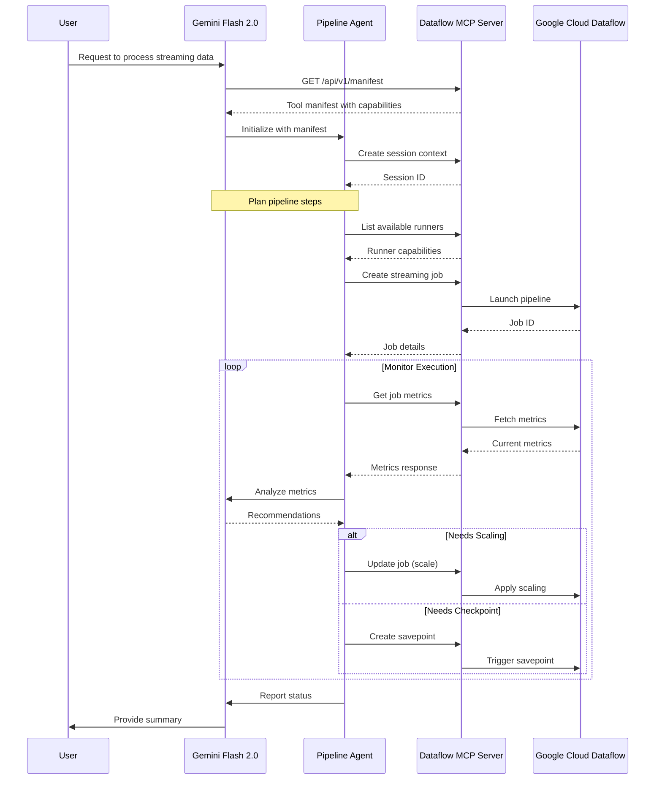

# LLM Integration Guide

This guide demonstrates how to integrate the Dataflow MCP server with Large Language Models (LLMs) for agentic control of data pipelines.

## Overview

The Dataflow MCP server provides a standardized interface that allows LLMs to:
1. Discover available capabilities through the manifest endpoint
2. Understand resource schemas and operations
3. Execute operations with proper context management
4. Handle errors and state transitions
5. Monitor and control pipeline execution

## Sequence Diagram



## Key Components

1. **LLM (Gemini Flash 2.0)**
   - Understands user intent
   - Plans pipeline operations
   - Makes decisions based on metrics
   - Provides high-level guidance

2. **Pipeline Agent**
   - Maintains MCP context
   - Executes LLM decisions
   - Monitors pipeline health
   - Handles error recovery

3. **MCP Server**
   - Provides tool discovery
   - Manages resources
   - Handles state transitions
   - Ensures protocol compliance

## Integration Patterns

### 1. Tool Discovery
The LLM first discovers available capabilities through the manifest endpoint:
```python
manifest = await mcp_client.get_manifest()
tools = manifest["tools"]
```

### 2. Context Management
All operations maintain proper context for tracing and state management:
```python
context = await mcp_client.create_context(
    session_id="unique-session",
    user_id="user-123"
)
```

### 3. Resource Operations
Operations are executed with proper validation and error handling:
```python
try:
    job = await mcp_client.create_job(
        params=job_params,
        context=context
    )
except MCPError as e:
    # Handle error
```

### 4. Monitoring and Control
Continuous monitoring with metric analysis:
```python
metrics = await mcp_client.get_metrics(
    job_id=job.job_id,
    context=context
)
```

## Best Practices

1. **Context Preservation**
   - Maintain session context across interactions
   - Include trace IDs for debugging
   - Preserve user context for permissions

2. **Error Handling**
   - Handle MCPErrors appropriately
   - Implement retry logic
   - Maintain error context

3. **Resource Lifecycle**
   - Clean up resources properly
   - Monitor resource states
   - Handle timeouts

4. **Security**
   - Validate LLM decisions
   - Implement rate limiting
   - Monitor resource usage

## Example Use Cases

1. **Streaming Pipeline Management**
   - Create and monitor streaming jobs
   - Auto-scale based on metrics
   - Handle backpressure

2. **Batch Processing**
   - Schedule batch jobs
   - Monitor progress
   - Handle failures

3. **Pipeline Migration**
   - Create savepoints
   - Upgrade pipelines
   - Verify state 