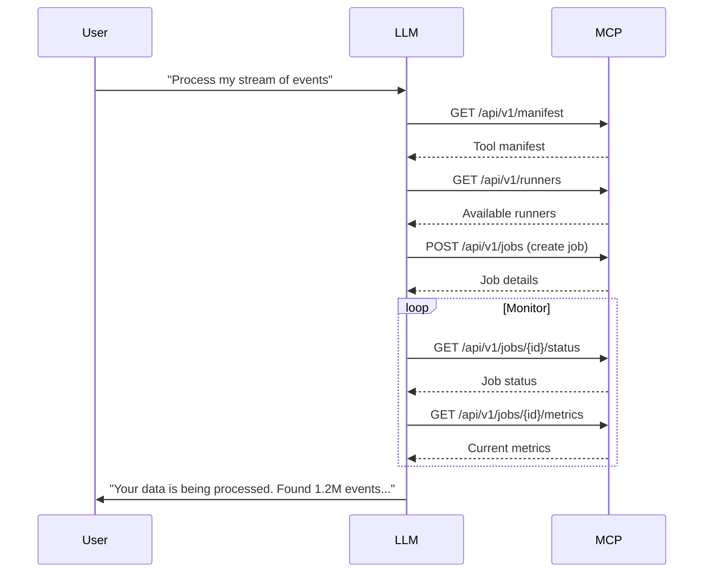

# LLM Integration Guide

This guide shows how to integrate the Apache Beam MCP Server with Large Language Models (LLMs) for AI-controlled data pipelines.

## Quick Start

```python
import requests
import json

# 1. Fetch the server manifest to discover capabilities
manifest = requests.get("http://localhost:8888/api/v1/manifest").json()

# 2. Set up persistent session ID for context tracking
headers = {"MCP-Session-ID": "llm-session-123"}

# 3. List available runners
runners = requests.get(
    "http://localhost:8888/api/v1/runners", 
    headers=headers
).json()

# 4. Create a data processing job
job = requests.post(
    "http://localhost:8888/api/v1/jobs",
    headers=headers,
    json={
        "job_name": "llm-controlled-wordcount",
        "runner_type": "flink",
        "job_type": "BATCH",
        "code_path": "examples/pipelines/wordcount.py",
        "pipeline_options": {
            "parallelism": 2,
            "input_file": "/tmp/input.txt",
            "output_path": "/tmp/output"
        }
    }
).json()

# 5. Monitor the job
job_status = requests.get(
    f"http://localhost:8888/api/v1/jobs/{job['data']['job_id']}",
    headers=headers
).json()
```

## Integration Architecture

LLMs can interact with the Apache Beam MCP Server in two key ways:

1. **Direct API Integration**: LLM makes API calls based on user requests
2. **Agent-based**: LLM delegates to a specialized agent that manages pipelines

### Sequence Flow



## Key Integration Points

### 1. Discovery Phase

LLMs should first discover the available tools by calling the manifest endpoint:

```python
manifest = requests.get("http://localhost:8888/api/v1/manifest").json()
```

The manifest includes:
- Available API endpoints
- Expected parameters
- Supported runners
- Job types

### 2. Job Lifecycle Management

LLMs can create and manage jobs with the following endpoints:

| Operation | Endpoint | Method | Description |
|-----------|----------|--------|-------------|
| Create job | `/api/v1/jobs` | POST | Create a new pipeline job |
| List jobs | `/api/v1/jobs` | GET | List all jobs |
| Get job | `/api/v1/jobs/{id}` | GET | Get job details |
| Cancel job | `/api/v1/jobs/{id}` | DELETE | Cancel a job |
| Get metrics | `/api/v1/jobs/{id}/metrics` | GET | Get job metrics |

### 3. Error Handling

LLMs should always check the `success` field and handle errors gracefully:

```python
response = requests.get("http://localhost:8888/api/v1/jobs/invalid-id").json()
if not response["success"]:
    # Handle error case
    print(f"Error: {response['error']}")
```

## Example: LLM-controlled Flink Job

This example shows how to implement an LLM-controlled Flink job that processes data:

```python
def create_flink_job(input_file, output_path, parallelism=2):
    """Create a Flink job based on user request."""
    response = requests.post(
        "http://localhost:8888/api/v1/jobs",
        headers={"MCP-Session-ID": "llm-session-456"},
        json={
            "job_name": "user-requested-analysis",
            "runner_type": "flink",
            "job_type": "BATCH",
            "code_path": "examples/pipelines/wordcount.py",
            "pipeline_options": {
                "parallelism": parallelism,
                "jar_path": "/path/to/beam-examples.jar",
                "entry_class": "org.apache.beam.examples.WordCount",
                "program_args": f"--input {input_file} --output {output_path}"
            }
        }
    )
    return response.json()
```

For a complete example implementation, see `examples/llm_agent.py` in the repository.

### Retrieving API Information

First, get the server's API manifest to understand available endpoints:

```python
import requests

manifest = requests.get("http://localhost:8888/api/v1/manifest").json()
```

### Getting Available Runners

```python
runners_response = requests.get(
    "http://localhost:8888/api/v1/runners",
    headers={"Authorization": f"Bearer {API_KEY}"}
)
runners = runners_response.json()
```

### Creating a Job

```python
job_response = requests.post(
    "http://localhost:8888/api/v1/jobs",
    headers={"Authorization": f"Bearer {API_KEY}"},
    json={
        "pipeline": "gs://my-bucket/wordcount.py",
        "runner": "dataflow",
        "options": {
            "project": "my-gcp-project",
            "region": "us-central1",
            "temp_location": "gs://my-bucket/temp",
            "input": "gs://dataflow-samples/shakespeare/*",
            "output": "gs://my-bucket/output/wordcount"
        }
    }
)
job = job_response.json()
```

### Monitoring Job Status

```python
while True:
    status_response = requests.get(
        f"http://localhost:8888/api/v1/jobs/{job['data']['job_id']}",
        headers={"Authorization": f"Bearer {API_KEY}"}
    )
    status = status_response.json()
    
    current_state = status['data']['state']
    if current_state in ['SUCCEEDED', 'FAILED', 'CANCELLED']:
        break
        
    time.sleep(10)  # Poll every 10 seconds
```

### Simple LLM Integration Example

```python
def execute_llm_request(llm_request):
    """Process a natural language request from an LLM."""
    # Step 1: Parse the LLM request
    parsed_request = parse_llm_request(llm_request)
    
    # Step 2: Get the MCP server capabilities
    manifest = requests.get("http://localhost:8888/api/v1/manifest").json()
    
    # Step 3: Map the request to MCP operations
    operations = map_request_to_mcp_operations(parsed_request, manifest)
    
    # Step 4: Execute operations and handle responses
    responses = []
    for operation in operations:
        if operation['type'] == 'job_creation':
            response = create_job(operation['params'])
            responses.append(response)
        elif operation['type'] == 'data_query':
            response = query_data(operation['params'])
            responses.append(response)
    
    # Step 5: Generate a coherent response
    return format_response_for_llm(responses)
```

### Error Handling Example

```python
def handle_error_example():
    # Request a non-existent job
    response = requests.get("http://localhost:8888/api/v1/jobs/invalid-id").json()
    
    if not response['success']:
        print(f"Error: {response['message']}")
        # Take appropriate action based on error message
        
    # Retry logic for transient errors
    max_retries = 3
    for attempt in range(max_retries):
        try:
            response = requests.post(
                "http://localhost:8888/api/v1/jobs",
                json=job_definition,
                timeout=5
            ).json()
            if response['success']:
                return response
        except (requests.Timeout, requests.ConnectionError):
            time.sleep(2 ** attempt)  # Exponential backoff
    
    return {"success": False, "message": "Max retries exceeded"}
```
  